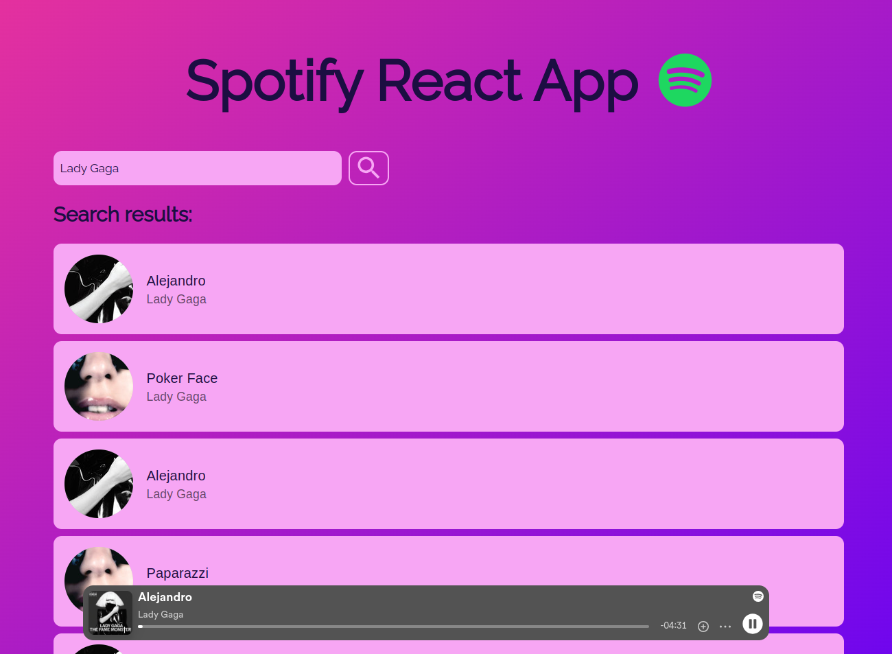

# Spotify-React-App

## Table of Contents

- [Introduction](#introduction)
- [Spotify-React-App Developers](#beyondwork-developers)
- [Features](#features)
- [Requirements](#requirements)
- [Usage](#usage)
- [Technologies Used](#technologies-used)
- [Project Structure](#project-structure)
- [Screenshot](#screenshot)

## Introduction
Spotify-React-App is a program that uses the Spotify API to let the user log in and out their Spotify account, search through the Spotify library and play tracks on a Spotify embedded player. The experience is enriched by a beautiful and user-friendly design.

## Spotify-React-App Developers
This is an individual project, meaning I am the only developer behind it. I also completely designed the UI and UX of application. You can find me [here](https://github.com/elenarmaroli).

## Features
- Login to Spotify account
- Logout
- Search function (works for tracks, artists and albums)
- Spotify embedded player: play a track, pause it, save it in your favorites

## Requirements
- Spotify premium account
- npm install
- axios
- react
- react-dom
- react-spotify-web-playback
- material ui
- To run client side: npm start

## Usage
- Run the development server: `npm start`
- Access the application at `http://localhost:3000`

## Technologies Used
- React.js
- Git & Github
- axios
- npm 
- MUi
- CSS3

## Project Structure
- `spotify-app/`: Contains the frontend React code.

## Screenshot
Here, you can see the sleek and user-friendly interface, complete with the Spotify embedded player seamlessly playing a track. The play, pause, and save buttons are easily accessible, providing a smooth and enjoyable user experience. The integration with the Spotify API allows for real-time interaction with the user's Spotify account. 

